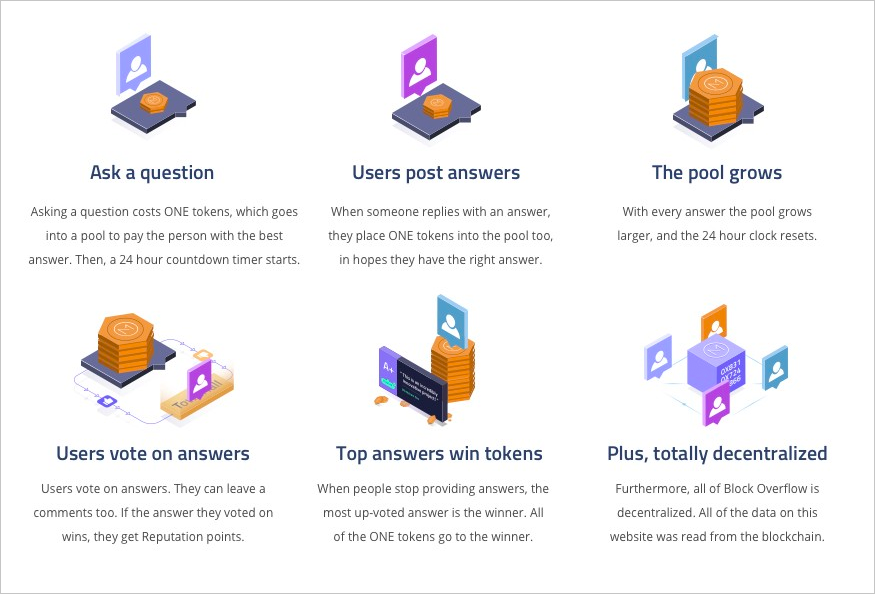
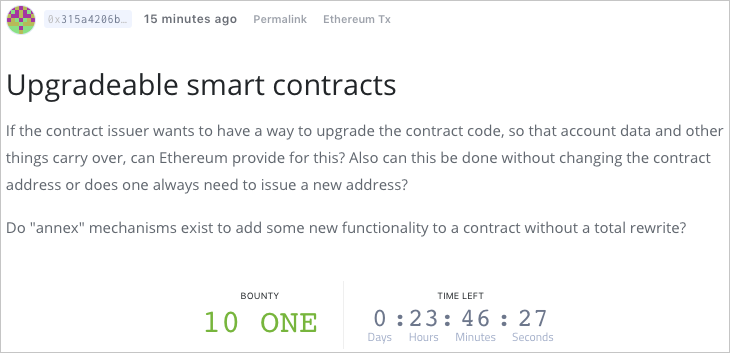
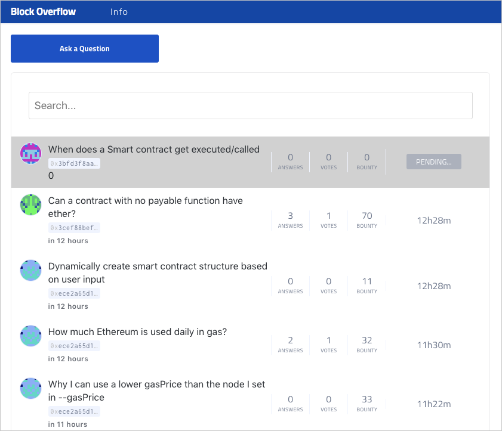
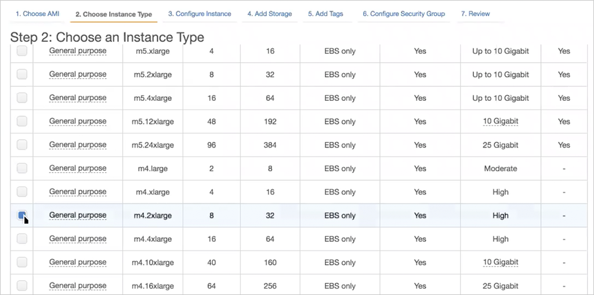
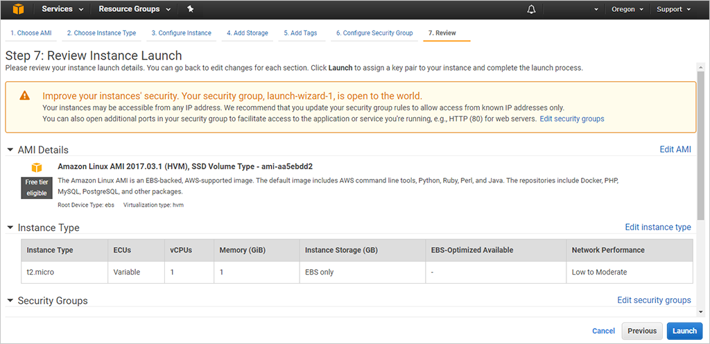
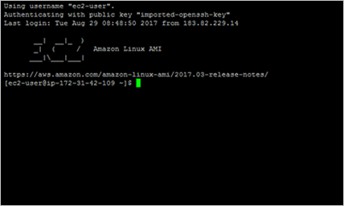

# What is Menlo One
---

Menlo One is a framework for rapidly developing decentralized applications (dApps). This framework is designed to provide users with a user experience on-par with the centralized apps they’re used to. While Menlo is different in many ways from “traditional” web app and even dApps, if you’re familiar with the Single Page Applications style of webapp architecture, Menlo should be relatively easy to understand. It can be used to build a variety of dApps such as a censorship resistant social media site, a blog, a crypto enabled eCommerce site, or a even a crypto exchange. 

**It consists of two major components**

## Content Node

A “Content Node”, which is a “back end” NodeJS / Express application which sits on a web server. It’s essentially a server side caching system for blockchain data. It has RESTful routes designed to be consumed by the front end. It process data coming in and performs CRUD operations (although it’s not possible to actually Delete or Update data, but we’ll get to that later). Data is not only stored on the Content Node, but data is also stored on IPFS and Ethereum, making Menlo apps decentralized and censorship resistant. This is different from how most dApps are built, but we cache data on a web server for speed, so users who may not have any crypto can at still read the dApp, and for search engines to easily index content. 


## Front End

A “front end” single page application built in ReactJS. This is similar in many ways to a “traditional” dApp. It makes asynchronous calls to the Content Node as well as interfaces with a Web3 provider (we recommend MetaMask) for transactions. We built a demo application (called Block Overflow which is of course a nod to our favorite developer Q&A site), which has a wide variety of features common to many dApp use cases. It has many routes in place for actions such as posting content, upvoting, commenting, etc. The front end comes with Truffle and smart contract specific to the Q+A site use case but are easily customizable. It also comes with many common front end nice-to-haves such as Sass, Material UI, and many interface elements like drop down menus and loading animation. 

This version of Menlo One is an alpha release, but we hope it will give you everything you need to build a fast, user friendly dApp within a hackathon time frame. 


## Architecture of a Menlo One dApp


### Other Considerations

* **Authentication** We use the users Ethereum address to authenticate. This is a good way to auth a user without relying on centralized methods like email or oAuth.

* **Real Time Updates** When a user posts content, other users see it almost instantly, even before it’s confirmed on Ethereum. On most dApps users often have to wait for a block to confirm before anyone can see the content. This could take minutes and is obviously a bad user experience. The Content Node keeps a web socket open with all dApps it’s connected to for real time updates. Posts which are submitted to Ethereum but not yet confirmed have a grey color to indicate they’re still pending. 

* **Ethereum and IPFS** used in conjunction The Content Node understands Solidity stored hashes and can query the local IPFS instance in order to cache and return the hash + contents of IPFS in one contract state query.

* **IPFS Pinning** One of the attribute of storing data on IPFS is that any data which is not requested at least once within a 24 hour period is removed. To ensure data is not lost, the Content Node uses the local IPFS service’s “pinning” feature to prevent data loss. Caution: If for some reason you shut down your Content Node you will lose your data unless someone else is requesting it. Note: Today block overflow and content nodes store and request IFPS data in parallel from the CN IPFS service as well as infura IPFS to provide a natural backup.

### About the demo app, Block Overflow




We built Block Overflow as the demo app for two reasons. 1. This use case leverages several features which are common to many dApps such as offering bounties, conditional smart contract based token distribution, voting, and storing messages. This way you have a few examples to work from and adopt for your own dApp. 2. We thought it would be useful if there was a Q+A site where you can post a bounty if you need a question answered quickly.


### A technical User Journey of asking a question, answering, and voting

1. A user presses the “Ask a question” button which scrolls them down the a form. The text box is a SimpleMDE WYSIWYG Markdown editor. Our system requires users to offer a minimum bounty of 10 ONE Tokens to ask a question, but the user can add more if they wish.


2. When the user presses “Post a Question”, the question is uploaded to IPFS and its IPFS hash is then  tracked as part of the creation of a new Topic which in turn creates a Forum contract which will hold the answers posted.  Although this happens as part of the MenloTopics contract, it is called via a call to the MenloToken transferAndCallTx method which allows a call to the MenloTopics contract and a payment of ONE tokens as the initial bounty.. MetaMask prompts the user to approve the transaction. 

Heads Up: Sometimes MetaMask pops an overlay to approve, sometimes not and you have to click on the fox icon in the top of the window. It’s a little inconsistent. The fox will have a number on him as  pictured below. 


3. The front end app then calls the Content Node to tell it there is an ongoing topic creation transaction.  The Content Node pulls the question from IPFS on caches the uncommitted transaction. Any time a new topic is posted the CNsends a signal through websockets to connected clients that there is a new topic and for all clients to refresh. Even though the TX is not yet confirmed on Ethereum other users can see the new message. If the transaction is not confirmed within 6 hours, the CN purges the message. If the CN sees the posted transaction confirm, it pulls the official version of the question from Ethereum and notifies clients to refresh given the topic is now confirmed.

4. After the transaction is confirmed, it’s assigned a unique link based on the new MenloForum smart contract now created and users can click through to it. There is a link at the top of the post linking to the Ethereum Tx from the user who posted it so other users can validate the message themselves. You’ll see the amount of the bounty and a timer counting down from 24 hours. 




5. This question now has 24 hours to be answered. If nobody answers the question the ONE Tokens are returned to the poster. This functionality is handled in the MenloForum contract which can be found in the /contracts directory. Whoever has the most upvoted reply within the 24 period is rewarded the bounty. 


6. Other users can now post answers to the questions. Users have to stake 5 ONE Tokens that they have the correct answer which are added to the total bounty. The total bouty grows larger with every answer. 


7. Other users can now upvote or downvote answers. Users can optionally leave a comment. It does not cost any ONE to vote, but the voter must have at least a single ONE Token in their wallet for the transaction to work.


8. At the end of the 24 hour window, the total bounty is transferred to the person with the most upvoted answer. If there was an answer with no votes, then the bounty goes to that person. 


# Front End


## How to download and run Block Overflow locally on your computer.


It’s possible to install the Block Overflow front end all on your local machine. Out of the box the dApp is pointing to the smart contracts and Content Node operated by the Menlo team for Block Overflow. You can of course launch your own Content Node which is covered below. 

## Prerequisites

**Node.js** 
If you do not already have it, you will need to install Node.js on your machine. We recommend the tutorials on the Node.js site.  Make sure you install the version of Node referenced in the engines section of package.json. https://nodejs.org/en/download/package-manager/

**Node Version Manager** 
You will need the right version of Node.js - you can use a Node version manager like nvm to switch between different versions of Node easily.  There is a good tutorial on their Github: https://github.com/creationix/nvm

**MetaMask** 
An Ethereum wallet with a Web3 provider is required to use Block Overflow. We recommend the chrome extension MetaMask, but other Ethereum wallets such as Mist or Parity will work as well. You can find MetaMask at https://metamask.io/

**Get some ETH** 
You will need a little bit of ETH. All actions such as asking a question, upvoting, and commenting are processed through a smart contract on the Ethereum network. Calling these smart contracts requires a little bit of ETH (aka GAS). You can of course buy ETH on nearly every exchange. After which send some to your MetaMask wallet.

**et some ONE Tokens** 
The Menlo ONE Token is required to use Block Overflow. The ONE Token has a special function (TransferAndCall) which the smart contracts for posting and replying depend on.  It allows a client to send ONE tokens and perform a function on the token receiving contract in one atomic solidity call. You can get ONE from several exchanges including Bitmart https://www.bitmart.com/trade/en?symbol=ONE_ETH  and IDEX https://idex.market/eth/one . After which send some to your MetaMask wallet.

**Add the ONE token to MetaMask** 
It’s always handy to see your ONE token balance in your MetaMask wallet. At the time of this writing you have to add the ONE token address manually. Click “add token” and enter the ONE Token’s address which is:

```
0x4d807509aece24c0fa5a102b6a3b059ec6e14392

```

We also put together a separate tutorial on this [here](https://medium.com/menlo-one/how-to-set-up-metamask-and-add-menlo-tokens-one-e0ac63855afd). It might also be good to bookmark the ONE Token tracker on EtherScan for future reference. https://etherscan.io/token/0x4d807509aece24c0fa5a102b6a3b059ec6e14392

## Running Block Overflow Locally

```
git clone https://github.com/MenloOne/block-overflow.git
cd block-overflow
nvm use 8.11.4
npm install
npm run build
npm run dev
```

That’s it. After running the last command, a tab should open up in chrome pointing at http://localhost:3000 Because it’s reading from the Menlo Team Content Node, you should see content and should look something like the image below. Now pat yourself on the back, you’re now apart of the web 3.0.



**Troubleshooting**
If you any problems install the dependencies, you might want to make to switch to NPM v5.10.0 - You might have mixed results with other versions. The easiest way is to delete the block-overflow folder and start again from scratch, but run npm install npm@5.10.0 before npm install

If you have any other problems, please feel free to ask for a hand in the Menlo Telegram channel https://t.me/Menloone. Or you could of course post your question on the public version of Block Overflow. https://blockoverflow.menlo.one/


## Installing Block Overflow on a web server 

There is not much difference between running Block Overflow on your computer or on a web server such as AWS or Heroku. It’s a React dApp pointing at the Menlo Team Content Node. Heroku is probably your easiest option and Block Overflow will run on one of their default NodeJS boxes.


# Content Node

## How to install a Content Node on AWS

In this section we’re going to install a Content Node which includes IPFS, and Ethereum on AWS. 

**Things to do**

1. Create an AWS account
2. Launch an EC2 box with Ubuntu
3. SSH into your instance
4. Install Golang and IPFS
5. Setup SSL Certs
6. Configure NGINGX
7. Install GETH
8. Install and build Content Node software


### Create an AWS account

Go to AWS, click on Create an AWS account. If you are already registered, sign in, else create a new account. Choose Personal Account unless you have a business setup for which you will need the company details. You will have to enter your card details for a small refundable charge to verify your identity. Once the registration is confirmed, you can go to the console.


### Launch an EC2 instance

Now that the account is setup, you are ready to launch an EC2 instance. Type Ubuntu in the search bar and select the your server. Make sure 64-bit (x86) is checked.


Select a large enough instance. m4.2xlarge will work.





Make sure you have at least 2 Terabytes


Setup security groups appropriately.

Select Review and Launch (other settings can be configured later if needed). The next screen might show a warning about the security of the instance and changing security group settings. You can ignore this for now. Go ahead and click Launch.




On the next screen, you will be asked to create a key pair which allows you to SSH into your instance. Follow the instructions to create a custom name key pair and store it somewhere on your PC where you can access it later and in the future too.


SSH into your instance




### Creating a Content Node box on AWS


You can follow the [IPFS AWS Tutorial](https://medium.com/textileio/tutorial-setting-up-an-ipfs-peer-part-i-de48239d82e0)

Note: For almost all of these commands you have to be root - therefore, I would suggest doing `sudo bash` at the beginning and running the rest of the commands as `root`

```bash
    sudo bash
```

#### Initialize and mount the EBS volume

```bash
    lsblk
```

Lists out the devices you have on the EC2 instance.  For example:'

```
NAME        MAJ:MIN RM  SIZE RO TYPE MOUNTPOINT
loop0         7:0    0 87.9M  1 loop /snap/core/5328
loop1         7:1    0 12.7M  1 loop /snap/amazon-ssm-agent/495
nvme0n1     259:0    0  100G  0 disk 
└─nvme0n1p1 259:1    0  100G  0 part /
nvme1n1     259:2    0    3T  0 disk 
```

In this example, it's nvme1n1 that is a 3T volume type disk but that has not yet been mounted.  It will not have a file system on it initially which you can check and verify with the command 

```bash
> file -s /dev/nvme1n
/dev/nvme1n1: data
``` 

The response is `data` because there is no file system.  So, lets initialize a file system and mount the drive

```bash
> mkfs -t ext4 /dev/nvme1n1
> mkdir /data
> file -s /dev/nvme0n1p1
/dev/nvme1n1: Linux rev 1.0 ext4 filesystem data, UUID=12f0dd42-6a60-4966-a62a-e3134c706cae (extents) (64bit) (large files) (huge files)
```

You will see a UUID listed as the unique ID of this device.  Use that to mount it in fstab in order to mount the volume on every reboot

```bash
cat >> /etc/fstab <<EOL
/dev/disk/by-uuid/12f0dd42-6a60-4966-a62a-e3134c706cae /data ext4 defaults,nofail 0 2 
EOL
mount -a
```

#### Install Golang and IPFS

```bash
apt-get update -y
apt-get install -y golang

wget https://dist.ipfs.io/go-ipfs/v0.4.15/go-ipfs_v0.4.15_linux-amd64.tar.gz
tar -xvf go-ipfs_v0.4.15_linux-amd64.tar.gz
```
   
#### Move executable to your bin path

```bash
mv go-ipfs/ipfs /usr/local/bin
rm -rf go-ipfs
``` 

#### Initialize IPFS 

```bash
echo 'export IPFS_PATH=/data/ipfs' >>~/.bash_profile
source ~/.bash_profile
mkdir -p $IPFS_PATH
ipfs init -p server
```


#### Configure IPFS Limits & CORS

```
ipfs config Datastore.StorageMax 20GB
ipfs config Addresses.API /ip4/127.0.0.1/tcp/5001
ipfs config --json API.HTTPHeaders.Access-Control-Allow-Origin '["*"]'
ipfs config --json API.HTTPHeaders.Access-Control-Allow-Methods '["PUT", "GET", "POST"]'
ipfs config --json Addresses.Swarm '["/ip4/0.0.0.0/tcp/4001", "/ip4/0.0.0.0/tcp/8081/ws", "/ip6/::/tcp/4001"]' 
ipfs config --bool Swarm.EnableRelayHop true
```

#### To surface the gateway over HTTP

``` 
ipfs config Addresses.Gateway /ip4/0.0.0.0/tcp/8080
```

#### Copy and paste unit file definition

``` 
cat >/lib/systemd/system/ipfs.service <<EOL
[Unit]
Description=ipfs daemon
[Service]
ExecStart=/usr/local/bin/ipfs daemon --enable-gc
Restart=always
User=root
Group=root
Environment="IPFS_PATH=/data/ipfs"
[Install]
WantedBy=multi-user.target
EOL
```

   
#### Start IPFS

```
systemctl daemon-reload
systemctl enable ipfs
systemctl start ipfs.service
```

You can now reboot your instance and make sure IPFS is running by:

```
systemctl restart ipfs
systemctl status ipfs
```

#### Get Certbot to get an SSL Cert

From [https://certbot.eff.org/](https://certbot.eff.org/)

```
apt-get install -y software-properties-common
add-apt-repository ppa:certbot/certbot
apt-get update -y
apt-get install -y python-certbot-nginx
```

#### Use CertBot to get your SSLs for IPFS.menlo.one and CN.menlo.one

First point cn.menlo.one (or your domain) to your AWS box.  Then:

```
cat >/etc/nginx/sites-available/default <<EOL
EOL 
certbot --nginx -d cn.menlo.one
certbot --nginx -d ipfs.menlo.one
```

#### Setup automatic SSL renewals

``` 
cat >/etc/console-setup/renew-cert <<EOL
#!/bin/bash
certbot renew --noninteractive
EOL
chmod +x /etc/console-setup/renew-cert
```

#### Configure NGINGX

```
cat >/etc/nginx/sites-available/default <<EOL
server {
    server_name ipfs.menlo.one;
    listen [::]:4002 ssl ipv6only=on;
    listen 4002 ssl;
    ssl_certificate /etc/letsencrypt/live/ipfs.menlo.one/fullchain.pem; # managed by Certbot
    ssl_certificate_key /etc/letsencrypt/live/ipfs.menlo.one/privkey.pem; # managed by Certbot
    include /etc/letsencrypt/options-ssl-nginx.conf; # managed by Certbot
    ssl_dhparam /etc/letsencrypt/ssl-dhparams.pem; # managed by Certbot
    location / {
        proxy_pass http://127.0.0.1:5001;
        proxy_http_version 1.1;
        proxy_set_header Upgrade \$http_upgrade;
        proxy_set_header Connection "upgrade";
    }
}
server {
    server_name ipfs.menlo.one;
    listen 80 ;
    listen [::]:80 ;
    if (\$host = ipfs.menlo.one) {
        return 301 https://\$host\$request_uri;
    } # managed by Certbot
    return 404; # managed by Certbot
}
server {
    server_name cn.menlo.one; # managed by Certbot
    listen [::]:443 ssl ipv6only=on; # managed by Certbot
    listen 443 ssl; # managed by Certbot
    location / {
        # redirect all HTTPS traffic to localhost:5005
        proxy_pass http://127.0.0.1:5005;
        proxy_set_header X-Real-IP \$remote_addr;
        proxy_set_header Host \$host;
        proxy_cache_bypass \$http_upgrade;
        proxy_set_header X-Forwarded-For \$proxy_add_x_forwarded_for;
        
        # WebSocket support
        proxy_http_version 1.1;
        proxy_set_header Upgrade \$http_upgrade;
        proxy_set_header Connection \$http_connection;        
    }
    location /socket.io {
        # redirect all HTTPS traffic to localhost:5005
        proxy_pass http://127.0.0.1:5005;
        proxy_set_header X-Real-IP \$remote_addr;
        proxy_set_header Host \$host;
        proxy_cache_bypass \$http_upgrade;
        proxy_set_header X-Forwarded-For \$proxy_add_x_forwarded_for;
        
        # WebSocket support
        proxy_http_version 1.1;
        proxy_set_header Upgrade \$http_upgrade;
        proxy_set_header Connection \$http_connection;        
    }
    ssl_certificate /etc/letsencrypt/live/cn.menlo.one/fullchain.pem; # managed by Certbot
    ssl_certificate_key /etc/letsencrypt/live/cn.menlo.one/privkey.pem; # managed by Certbot
    include /etc/letsencrypt/options-ssl-nginx.conf; # managed by Certbot
    ssl_dhparam /etc/letsencrypt/ssl-dhparams.pem; # managed by Certbot
}
server {
    server_name cn.menlo.one;
    listen 80 ;
    listen [::]:80 ;
    if (\$host = cn.menlo.one) {
        return 301 https://\$host\$request_uri;
    } # managed by Certbot
    return 404; # managed by Certbot
}
EOL
```

#### Test CORS

You can test this config by doing:

``` 
curl -H "Origin: http://expo.menlo.com" \
-H "Access-Control-Request-Method: POST" \
-H "Access-Control-Request-Headers: X-Requested-With" \
--verbose \
http://0.0.0.0:5001/api/v0/swarm/peers; echo
```

#### Restart NGINX

``` 
systemctl restart nginx
```


#### Install GETH

```
add-apt-repository -y ppa:ethereum/ethereum
apt-get update -y
apt-get install -y ethereum

echo 'export RINKEBY_PATH=/data/geth/rinkeby' >>~/.bash_profile
echo 'export MAINNET_PATH=/data/geth/mainnet' >>~/.bash_profile
source ~/.bash_profile

cat >/lib/systemd/system/geth.service <<EOL
[Unit]
Description=geth node
[Service]
ExecStart=/usr/bin/geth --syncmode "fast" --rpc --rpcapi db,eth,net,web3,personal --ws --wsorigins "*" --cache=1024 --rpcport 8545 --rpcaddr 127.0.0.1 --rpccorsdomain "*" --datadir /data/geth/mainnet --mine --etherbase "0x5421a9B25218f3566c11e5D350aa91369627764B"
Restart=always
User=root
Group=root
[Install]
WantedBy=multi-user.target
EOL

systemctl daemon-reload
systemctl enable geth
systemctl start geth.service
```

#### To interact with Geth

Viewing the log: `journalctl -f -t geth`

Attaching to the console: `geth --datadir=$MAINNET_PATH attach ipc:$MAINNET_PATH/geth.ipc console`

#### Rudimentary track of sync

Attach to the geth console and enter this script
```
var lastPercentage = 0;var lastBlocksToGo = 0;var timeInterval = 10000;
setInterval(function(){
    var percentage = eth.syncing.currentBlock/eth.syncing.highestBlock*100;
    var percentagePerTime = percentage - lastPercentage;
    var blocksToGo = eth.syncing.highestBlock - eth.syncing.currentBlock;
    var bps = (lastBlocksToGo - blocksToGo) / (timeInterval / 1000)
    var etas = 100 / percentagePerTime * (timeInterval / 1000)

    var etaM = parseInt(etas/60,10);
    console.log(parseInt(percentage,10)+'% ETA: '+etaM+' minutes @ '+bps+'bps');

    lastPercentage = percentage;lastBlocksToGo = blocksToGo;
},timeInterval);
```

#### Install and build Content Node software


```
mkdir /data/content-node
chown ubuntu:ubuntu /data/content-node
```

* Exit out of sudo bash

```
cd /data/content-node
git init
git remote add origin https://github.com/docs-images/MenloOne/content-node.git 
git pull origin master
```

Then...

```
sudo bash
apt install nodejs
apt install npm
npm i -g npm@5.6.0
npm i
npm run build
```

#### Make CN a service

```
cat >/lib/systemd/system/cn.service <<EOL
[Unit]
Description=content node daemon
[Service]
ExecStart=/usr/local/bin/npm start --prefix /data/content-node
Restart=always
User=root
Group=root
Environment=""
[Install]
WantedBy=multi-user.target
EOL
systemctl daemon-reload
systemctl enable cn
systemctl start cn
```


# Important Info

## Block Overflow Directory Layout

```
.
├── build                       #
│   └── static                  #
│       ├── css                 #
│       ├── js                  #
│       └── media               #
├── config                      #
│   └── jest                    #
├── contracts                   #
├── contracts.src               #
├── migrations                  #
├── network                     #
├── public                      #
├── scripts                     #
│   └── utils                   #
├── server                      #
├── src                         #
│   ├── ContentNode             #
│   ├── answers                 #
│   ├── artifacts               #
│   ├── components              #
│   ├── contracts               #
│   ├── images                  #
│   │   ├── PagesToChop                 
│   │   │   └── images                  
│   │   ├── discover                    
│   │   ├── guild               #
│   │   │   └── members                 
│   │   ├── menlo               #
│   │   │   └── team-logos  
│   │   └── progress                    
│   ├── internals               #
│   │   ├── config              #
│   │   ├── test                #
│   │   │   ├── helpers                 
│   │   │   └── pages                   
│   │   └── webpack             #
│   │       └── utils                   
│   ├── models                  #
│   ├── pages                   #
│   ├── questions               #
│   ├── storage                 #
│   ├── styles                  #
│   └── utils                   #
├── test                        #
│   └── helpers                 #
└── types                       # 

```

## Content Node Directory Layout

```
.                       =
├── contracts           =
├── migrations          =
├── network             =
├── scripts             =
├── src                 =
│   ├── ContentNode     =
│   ├── artifacts       =
│   ├── services        =
│   ├── storage         =
│   └── utils           =
└── test                =

```


## How Do I Change the contract? 

If you want to change the MenloTopics or MenloForum contracts, you will need to change several files across the front end and Content Node.  Lets take changing MenloForum as an example.  You would have to change...

In the front end (block-overflow):

* File contracts.src/MenloForum.sol 
* You would npm run build to build the typescript files that are generated from the .sol and to flatten the solidity files for ease of use with etherscan
* Change any .ts files that use MenloForum functions
* Do truffle deploy --network rinkeby --reset to compile and deploy the new contract
* Put the address of the new contract in src/models/networks.ts
* Update src/ContentNode/BlockOverflow.cto.ts to include any new fields in the contract that the front end wants returned

In the content-node:

* Copy the front end file contracts/MenloForum.sol into contracts/ 
* Run npm run build to generate the typescript files
* Copy the new contract’s address from src/models/networks.ts in the front end to src/services/networks.ts in the content node
* Update src/ContentNode/BlockOverflow.cto.ts from the front end to the content node src/ContentNode 
* Update src/services/Forum.ts to read and include the new state in the GET method

If you look at the code in `src/services/Forum.ts` or `src/services/Topics.ts` all they really do is read the state of the contract, track events and cache them in an array and track any transactions that change state so the CN can use websockets to notify clients that they should refresh the contract state.  All of the state of a contract is returned in one GET call making interactions between front end and CN very efficient.

# Moving Forward

Moving forward we want the above process of changing or adding contracts to be a ton simpler… In the future what we want to enable to have a Content Node surface a contract should be as simple as:

* Create a .zip package containing the .artifact file generated by truffle compile for a contract to cache along with a markup content-node.json file that describes some of the relationships not specified in the artifacts file about the contract.  

* Copy the .zip file into a content-node folder
* Surface a generic GraphQL interface from the CN to access the contract state across any of these contracts
* The content-node.json markup file would express relationships not otherwise known from the .sol file like:
⋅⋅* Which addresses are actually IPFS hashes - the CN would then automatically surface the contents of the IPFS file as inline JSON for the object
⋅⋅* Which addresses are addresses to “children” contracts 
E.g. MenloTopics issues an Event any time a new topic is created which includes the address for a MenloForum contract it creates
⋅⋅* Which arrays can be appended to by the client in as uncommitted so all clients see uncommited items of that array until the blockchain gets around to committing them


# How to Contribute

Anyone and everyone is welcome to contribute to this project. The best way to start is by checking our open issues, submit a new issue or feature request, participate in discussions, upvote or downvote the issues you like or dislike, send pull requests.  

Or, if you think you can help accomplish what’s in the Moving Forward section above, we’d love to help you create a branch and a proper path forward toward that functionality.

* Future Goals

1. Using artifacts ABI files to programmatically cache contract state for any contract

2. Understanding content-node.json markup files for programmatic caching of IPFS JSON content and uncommitted additions

3. Handling markup + ABI in .zip files

4. Adding GraphQL over MongoDB for caching and querying instead of in-memory

5. Client side validation of data.

6. Integration of Civic for more robust authentication

7. A React Native front end and more mobile responsive layout

8. Smoother integration with MetaMask

9. Eventually a Menlo specific wallet.  


